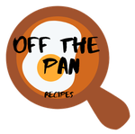

<h1 align="center">OffThePan</h1></br>

<p align="center">
:eyeglasses: A web app which recommends recipes based on the ingredients provided.
</p>
<br>

<p align="center">
  <a href="#"></a>
  <a href="#"></a>
  <a href="https://github.com/k4u5h4L"></a>
</p>

<br>
<p align="center">
</img>
</p><br>

## Features:

- You can search for recipes directly by searching by the name of the dish, or by <b>the ingredients in the dish</b>.

- You can specify the ingredients available with you and find yourself a recipe!

- You can also search for recipes by the cuisine.

- You can also filter out your intolerances in your results.

- Different diets such as vegan, vegetarian, etc, too.

- You can get wine recommendations to go with the food you choose. An amazon link will also be provided with the it so that you can buy if you don't have it.

## To run:

- Clone and cd into the repo.

```
git clone https://github.com/k4u5h4L/OffThePan.git && cd OffThePan
```

- Install the required dependencies

```
npm install
```

- Rename the `.env_sample` file to `.env` and fill in the needed API keys and data.

- Start the development server by running

```
npm run dev
```

This should spin up the site on [localhost:3000](http://localhost:3000).

## Note:

- This project is made as a hobby and is <b>NOT</b> a commercial application.

- Any contribution is welcome. You can fork and submit a pull request.
